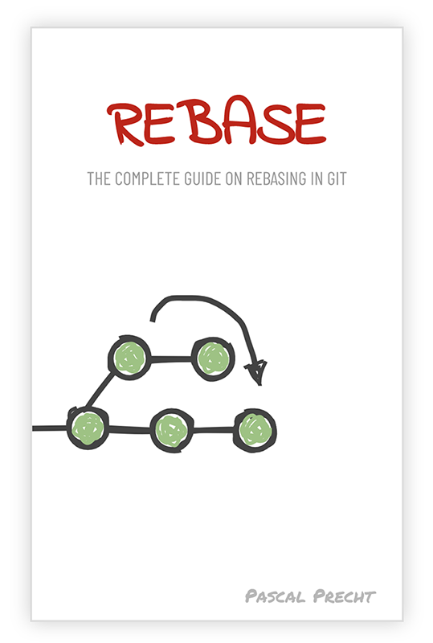

In December Pascal Precht announced his upcoming book [«REBASE - The complete Guide on Rebasing in Git»](https://rebase-book.com/). I know Pascal from his company Thoughtram, which gave an Angular On-Site Training in my Company last year. Since I know they also offer a Git master class, I see Pascal as a capable guy telling me things about Git, I don't know yet.

Since I've never been able to use a rebase-based workflow before, I immediately pre-ordered the e-Book which got delivered as promised by the end of January in a PDF, MOBI and EPUB version.

Last week I finally managed to read it back to back in a single session (it's 94 pages) and I'm very pleased with the content.

The book starts with teaching the internals of a Git repository. For me, this was one of the best parts as it gave me the answer why `git reset HEAD~1 --hard` does not mean, that the commit is entirely gone.

At the end I had a very good overview about the difference between merging and rebasing branches. I really like the approach of creating clean and concise branches with meaningful commits and having a history which allows an efficient usage of `git bisect`.

I concluded that while i personally would prefer rebasing, a team really needs a high maturity in working with Git to make this kind of workflow possible. If a team is not able to work with tidy and atomic commits, squashing pull requests into a single commit seems more useful to me than having a big pile of commits int the format:

-   Fix things
-   Fix even more things
-   Didn't work, another try

I can really recommend this book to anyone who wants to educate themselves to learn the internals of Git and the options available for working in a team with Git.

My only negative experience was the lack of contrast in the terminal screenshots on my Kindle. But since I also got the PDF version, that wasn't a big problem.
